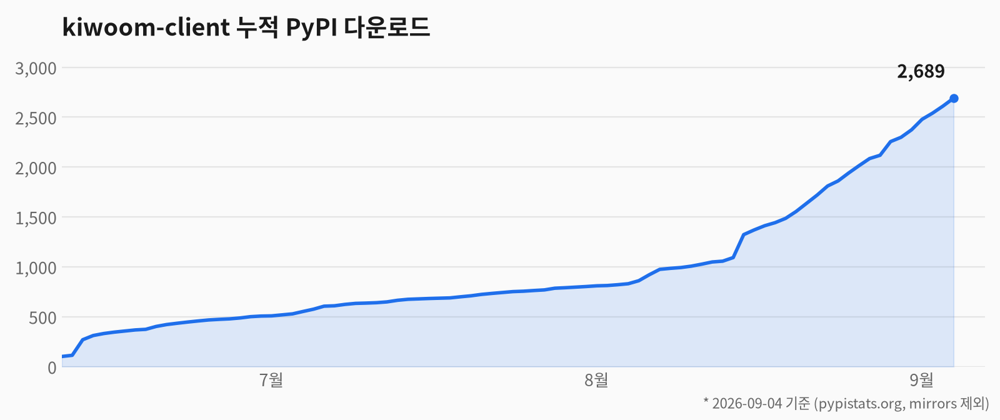
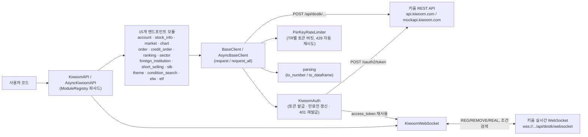

[한국어](README.md) | [English](README_EN.md)

# kiwoom-client — 키움증권 REST API Python 라이브러리

[](https://pypi.org/project/kiwoom-client/)
[](https://pypi.org/project/kiwoom-client/)
[](https://pepy.tech/project/kiwoom-client)
[](https://github.com/younghwan91/kiwoom-client/actions/workflows/ci.yml)
[](https://github.com/younghwan91/kiwoom-client/blob/main/LICENSE)
[](https://pypi.org/project/kiwoom-client/)
[](https://www.linkedin.com/in/younghwan-chae/)

<picture>
  <source media="(prefers-color-scheme: dark)" srcset="docs/images/pypi_downloads_dark.png">
  
</picture>

> **키움증권 OpenAPI를 대체하는 Python REST API 래퍼.**
> COM/OCX 없이 Windows · macOS · Linux 어디서나 **국내주식 자동매매 · 시세조회 · 실시간 WebSocket**을 사용할 수 있습니다.
> **토큰 자동 갱신**으로 봇이 만료에 죽지 않고, **sync / async** 양쪽을 지원합니다.
> **182개 REST 엔드포인트 · 조건검색 4종 · 19종 실시간 데이터** · 모의투자/실전투자 지원.

```bash
pip install kiwoom-client
```

**실제로 돌아가는 곳** — [quant-airflow](https://github.com/younghwan91/quant-airflow)의 일일 수집 DAG 가
이 라이브러리로 시세·수급·신용·공매도를 매일 TimescaleDB 에 적재합니다. 같은 스택의 나머지는
[README 하단](#관련-프로젝트--오픈소스-퀀트-스택)에 있습니다.

## 목차

- [왜 이 라이브러리인가?](#왜-이-라이브러리인가)
- [기존 키움 OpenAPI / pykiwoom 과 무엇이 다른가?](#기존-키움-openapi--pykiwoom-과-무엇이-다른가)
- [설치](#설치)
- [사전 준비](#사전-준비)
- [빠른 시작](#빠른-시작)
- [asyncio 사용법](#asyncio-사용법)
- [응답을 숫자·DataFrame으로 받기](#응답을-숫자dataframe으로-받기)
- [실시간 WebSocket 데이터](#실시간-websocket-데이터)
- [연속 조회 (페이지네이션)](#연속-조회-페이지네이션)
- [에러 처리](#에러-처리)
- [요청 제한 (Rate Limit)](#요청-제한-rate-limit)
- [아키텍처](#아키텍처)
- [환경 설정](#환경-설정)
- [지원 API 목록](#지원-api-목록)

## 왜 이 라이브러리인가?

- **크로스 플랫폼**: REST API 기반이라 Windows, macOS, Linux 어디서나 동작합니다. COM/OCX 방식과 달리 서버 환경에서도 사용 가능합니다.
- **자동 토큰 관리**: 토큰을 알아서 발급하고, 만료 전에 갱신하고, 401이 나면 재발급 후 재시도합니다. 장시간 도는 봇이 토큰 만료로 죽지 않습니다.
- **sync / async 양쪽 지원**: `KiwoomAPI`와 `AsyncKiwoomAPI`가 같은 API를 제공합니다.
- **자동 페이지네이션**: `request_all()`로 연속조회를 한 줄에 처리합니다.
- **내장 Rate Limiter**: TR(api_id)별 토큰 버킷으로 호출 제한을 자동 관리합니다.
- **바로 쓰는 응답**: `to_dataframe()`이 `"+70000"` 같은 문자열을 숫자로 바꿔 DataFrame으로 넘겨줍니다.
- **완전한 커버리지**: 국내주식 182개 REST 엔드포인트 + 조건검색 4종 + 19종 실시간 WebSocket 데이터를 지원합니다.

## 기존 키움 OpenAPI / pykiwoom 과 무엇이 다른가?

기존 키움 **OpenAPI+(OCX/COM)**나 이를 감싼 `pykiwoom`은 32bit Windows에 묶여 있어 서버 배포·자동화가 어렵습니다.
이 라이브러리는 키움의 **신규 REST API**를 사용하므로 그 제약이 없습니다.

| 항목 | 키움 OpenAPI+ (OCX) | pykiwoom | **kiwoom-client** |
|------|---------------------|----------|---------------------|
| 연동 방식 | COM/OCX | OCX 래퍼 | **REST + WebSocket** |
| 운영체제 | Windows 전용 | Windows 전용 | **Windows · macOS · Linux** |
| Python 비트수 | 32bit 전용 | 32bit 전용 | **64bit 지원** |
| 서버/헤드리스 배포 | 어려움 (GUI 필요) | 어려움 | **가능** |
| 실시간 데이터 | 이벤트 콜백 | 이벤트 콜백 | **async WebSocket** |
| 설치 | 별도 모듈 설치 | OCX + 모듈 | **`pip install` 한 줄** |

> 이미 OCX 기반 코드를 쓰고 있다면, REST 방식으로 전환할 때 GUI 의존성과 32bit 제약을 한 번에 제거할 수 있습니다.

## 설치

```bash
pip install kiwoom-client
```

pandas 변환(`to_dataframe()`)까지 함께 쓰려면:
```bash
pip install 'kiwoom-client[pandas]'
```

또는 [uv](https://docs.astral.sh/uv/) 사용:
```bash
uv add kiwoom-client
```

소스에서 설치:
```bash
git clone https://github.com/younghwan91/kiwoom-client.git
cd kiwoom-client
pip install -e .
# 또는
uv pip install -e .
```

## 사전 준비

1. [키움 REST API 포털](https://openapi.kiwoom.com)에 가입합니다.
2. **API 사용신청**을 통해 `앱키(appkey)`와 `시크릿키(secretkey)`를 발급받습니다.
3. 환경변수 설정은 [`.env.example`](.env.example)을 참고하세요.
4. 처음에는 **모의투자**(`is_mock=True`)로 테스트한 뒤, 실전투자로 전환하세요.

## 빠른 시작

### 1단계: 연결

```python
from kiwoom_client import KiwoomAPI

# 모의투자 서버로 연결
api = KiwoomAPI(
    app_key="발급받은_앱키",
    app_secret="발급받은_시크릿키",
    is_mock=True,  # True=모의투자, False=실전투자
)
```

접근토큰은 첫 호출에서 자동 발급되고 만료 전에 갱신되므로 따로 할 일이 없습니다.
키가 올바른지 즉시 확인하고 싶다면 `api.login()`을 호출하세요 (선택).

### 2단계: 종목 조회

```python
# 삼성전자(005930) 기본 정보 조회
info = api.stock_info.basic_stock_info(stk_cd="005930")
print(info)

# 삼성전자 일봉 차트 조회
chart = api.chart.stock_daily_chart(stk_cd="005930", base_dt="20260326")

# 당일 거래량 상위 종목 조회 (파라미터 6개가 모두 필수입니다)
ranking = api.ranking.top_volume_today(
    mrkt_tp="0", stk_cnd="0", trde_qty_tp="0",
    prc_tp="0", trde_amt_tp="0", updn_tp="0",
)
```

### 3단계: 계좌 조회

```python
# 내 계좌 평가 현황
evaluation = api.account.account_evaluation()

# 예수금 상세 조회
deposit = api.account.deposit_detail()

# 체결 잔고 조회
position = api.account.filled_position()

# 미체결 주문 조회
unfilled = api.account.unfilled_orders()
```

### 4단계: 주문

```python
# 삼성전자 10주 지정가 매수
result = api.order.buy_order(
    dmst_stex_tp="01",   # 거래소 구분 (01: KRX)
    stk_cd="005930",     # 종목코드
    ord_qty=10,          # 주문 수량
    trde_tp="00",        # 주문 유형 (00: 지정가)
    ord_uv=70000,        # 주문 단가
)

# 매도 주문
api.order.sell_order(
    dmst_stex_tp="01",
    stk_cd="005930",
    ord_qty=10,
    trde_tp="00",
    ord_uv=75000,
)

# 주문 정정
api.order.modify_order(org_ord_no="원래주문번호", ord_qty=5, ord_uv=71000)

# 주문 취소
api.order.cancel_order(org_ord_no="원래주문번호", ord_qty=5)
```

### 5단계: 정리

```python
api.logout()  # 토큰 폐기 (선택)
api.close()   # 연결 종료

# with 문을 쓰면 close()는 자동입니다
with KiwoomAPI(app_key="앱키", app_secret="시크릿키", is_mock=True) as api:
    info = api.stock_info.basic_stock_info(stk_cd="005930")
```

## asyncio 사용법

`AsyncKiwoomAPI`는 `KiwoomAPI`와 같은 엔드포인트를 제공하며, 호출 앞에 `await`만 붙이면 됩니다.

```python
import asyncio
from kiwoom_client import AsyncKiwoomAPI

async def main():
    async with AsyncKiwoomAPI(app_key="앱키", app_secret="시크릿키", is_mock=True) as api:
        # 서로 다른 TR은 동시에 나간다 — 직렬로 돌리면 3배 걸린다
        info, chart, ranking = await asyncio.gather(
            api.stock_info.basic_stock_info(stk_cd="005930"),
            api.chart.stock_daily_chart(stk_cd="005930", base_dt="20260326"),
            api.ranking.top_volume_today(
                mrkt_tp="0", stk_cnd="0", trde_qty_tp="0",
                prc_tp="0", trde_amt_tp="0", updn_tp="0",
            ),
        )
        print(info["stk_nm"])

asyncio.run(main())
```

Rate Limiter는 TR(api_id)별로 걸립니다. 서로 다른 TR은 서로를 막지 않고 동시에 나가며,
같은 TR을 반복 호출할 때만 초당 1건으로 조여집니다. 전체 예제는
[`examples/async_usage.py`](examples/async_usage.py)를 참고하세요.

## 응답을 숫자·DataFrame으로 받기

키움은 모든 값을 문자열로 돌려줍니다. 가격은 `"+70000"`, 등락률은 `"-1.23"`,
거래량은 `"1,234,567"` 같은 식이라 그대로는 계산에 쓸 수 없습니다.

```python
from kiwoom_client import to_dataframe, to_number, normalize

result = api.ranking.top_volume_today(...)

# 페이로드 키를 자동으로 찾아 DataFrame으로 변환 (문자열 → 숫자 포함)
df = to_dataframe(result)
print(df["cur_prc"].mean())   # 바로 계산 가능

# dict 그대로 쓰고 싶다면
data = normalize(result)
price = to_number("+70000")   # 70000
```

종목코드(`"005930"`)처럼 앞자리 0이 의미를 갖는 값과, `base_dt` 같은 날짜·식별자
필드는 숫자로 바꾸지 않고 문자열로 남깁니다.


<sub>샘플 응답을 `to_dataframe()` 에 넣은 실제 출력입니다. 시세 값 자체는 예시입니다 — `stk_cd` 는 문자열로 남고 가격·거래량만 숫자가 되는 것을 보세요.</sub>

`to_dataframe()`에는 pandas가 필요합니다:

```bash
pip install 'kiwoom-client[pandas]'
```

## 실시간 WebSocket 데이터

실시간 체결가, 호가, 잔고 변동 등을 WebSocket으로 수신할 수 있습니다.

```python
import asyncio
from kiwoom_client import KiwoomAPI

api = KiwoomAPI(app_key="앱키", app_secret="시크릿키")
ws = api.create_websocket()

async def main():
    # connect()가 LOGIN 핸드셰이크까지 끝냅니다. 실패하면 KiwoomWebSocketError
    await ws.connect()

    # 콜백은 REAL 프레임의 항목 하나를 받습니다:
    # {"type": "0B", "item": "005930", "values": {"10": "+70000", ...}}
    ws.on("0B", lambda d: print(f"체결 {d['item']}: {d['values'].get('10')}"))
    ws.on("0D", lambda d: print(f"호가 {d['item']}: {d['values'].get('41')}"))

    # async 콜백도 그대로 등록할 수 있습니다
    async def save(d): ...
    ws.on("0B", save)

    # 삼성전자 실시간 체결+호가 구독
    await ws.subscribe("0B", "005930")
    await ws.subscribe(["0B", "0D"], ["005930", "000660", "035420"])

    # PING 응답과 재연결(재로그인·구독 복원)은 listen()이 알아서 처리합니다
    await ws.listen()

asyncio.run(main())
```

`values`의 키는 키움 FID 번호입니다(10=현재가, 13=누적거래량, 41=매도최우선호가).

### 조건검색

조건검색도 같은 WebSocket을 씁니다. `api.condition_search`가 요청 페이로드를 만들고,
`ws.send()`로 보낸 뒤 `ws.on_trnm()`으로 응답을 받습니다.

```python
await ws.connect()
ws.on_trnm("CNSRLST", lambda d: print("조건식 목록:", d["data"]))
ws.on_trnm("CNSRREQ", lambda d: print("검색 결과:", d.get("data")))

# 조건식 목록을 먼저 조회해야 seq를 알 수 있습니다
await ws.send(api.condition_search.condition_list())

# seq로 검색 (search_type="1"이면 실시간 편입/이탈까지 수신)
await ws.send(api.condition_search.condition_search_realtime(seq="1"))
await ws.listen()
```

> **검증 상태**: 실서버(api.kiwoom.com) 대상으로 LOGIN 핸드셰이크 · PING 프레임 ·
> REG 등록 응답까지 확인했습니다. 다만 **REAL 프레임의 항목 필드명(`item`/`values`)은
> 장 마감 중이라 아직 미확정**입니다. 장중 이상 동작을 만나면
> [이슈](https://github.com/younghwan91/kiwoom-client/issues)로 알려주세요.
> 직접 확인하려면 `python tests/integration_ws_smoke.py --prod` 를 돌리면 됩니다.

## 연속 조회 (페이지네이션)

데이터가 많은 API는 한 번에 모든 데이터를 반환하지 않습니다.
응답 헤더의 `cont_yn`이 `"Y"`이면 다음 페이지가 있다는 뜻입니다.

```python
# 방법 1: 수동 연속 조회
result = api.account.filled_orders()
# result에 cont_yn="Y"와 next_key가 있으면 다음 페이지 조회
next_result = api.account.filled_orders(cont_yn="Y", next_key=result["next_key"])

# 방법 2: 자동 전체 조회 (모든 페이지를 한번에)
from kiwoom_client.base import BaseClient
all_data = api._client.request_all(
    "/api/dostk/acnt", "ka10076",
    data_key="filled_list",  # 응답에서 리스트 데이터의 키 이름
)
```

## 에러 처리

```python
from kiwoom_client.base import KiwoomAPIError

try:
    result = api.order.buy_order(stk_cd="005930", ord_qty=10, ord_uv=70000)
except KiwoomAPIError as e:
    print(f"에러 코드: {e.code}")
    print(f"에러 메시지: {e.message}")
    print(f"전체 응답: {e.response}")
```

## 요청 제한 (Rate Limit)

키움 REST API는 **TR(api_id)별로 독립적인** 호출 제한을 둡니다. 실측 결과는 다음과 같습니다.

| 항목 | 측정값 |
|---|---|
| 지속(sustained) 안전 속도 | **TR당 약 1 req/s** (이 속도에선 거부 0) |
| 순간 버스트(burst) 허용량 | **TR당 약 2건** |
| 초과 시 응답 | HTTP `429` + `{"return_code": 5, "return_msg": "허용된 요청 개수를 초과하였습니다"}` |
| 제한 단위 | **TR(api_id)별 독립** — 서로 다른 TR은 영향 없음 |

이에 맞춰 라이브러리는 **기본적으로 TR별 토큰 버킷 Rate Limiter(1 req/s, 버스트 2)** 를 적용하고, 그래도 `429`가 발생하면 **자동으로 백오프 후 재시도**합니다. 별도 설정 없이도 안전하게 동작합니다.

```python
# 기본값: TR당 1 req/s, 버스트 2, 429 자동 재시도
api = KiwoomAPI(app_key="...", app_secret="...")

# 직접 조정 (예: TR당 2 req/s, 버스트 3, 재시도 5회)
api = KiwoomAPI(app_key="...", app_secret="...",
                rate_limit=2.0, rate_burst=3, max_retries=5)

# 클라이언트 측 스로틀 비활성화 (직접 제어할 때)
api = KiwoomAPI(app_key="...", app_secret="...", rate_limit=None)
```

> 제한이 TR별이라, **서로 다른 TR을 섞어** 호출하면 합산 처리량은 더 높습니다. 반대로 **같은 TR을 반복**(연속조회 루프 등)할 때는 1 req/s에 수렴합니다 — 이 경우 [`request_all()`](#연속-조회-페이지네이션)을 쓰면 페이지네이션을 안전하게 자동 처리합니다.

## 아키텍처

`KiwoomAPI`(sync) / `AsyncKiwoomAPI`(async)는 같은 구조를 공유하는 파사드입니다.
15개 엔드포인트 모듈은 `ModuleRegistry`가 지연 생성하고, 실제 HTTP 호출·인증·재시도는
`BaseClient`/`AsyncBaseClient` 한 곳에 모여 있습니다. 실시간 데이터는 REST와 별도로
`KiwoomWebSocket`이 같은 토큰을 재사용해 처리합니다.



## 환경 설정

| 구분 | 실전투자 | 모의투자 |
|------|---------|---------|
| `is_mock` | `False` (기본값) | `True` |
| REST URL | `https://api.kiwoom.com` | `https://mockapi.kiwoom.com` |
| WebSocket URL | `wss://api.kiwoom.com:10000` | `wss://mockapi.kiwoom.com:10000` |

## 지원 API 목록

### 인증

```python
api.login()      # 접근토큰 발급 (선택 — 첫 호출에서 자동 발급됩니다)
api.logout()     # 접근토큰 폐기
```

### 모듈별 커버리지 (182개 REST 엔드포인트)

| 모듈 | 개수 | 설명 |
|---|---|---|
| `api.account` | 33 | 계좌 — 예수금·잔고·손익·증거금·주문내역 |
| `api.stock_info` | 31 | 종목정보 — 기본정보·거래원·신용동향·업종코드 |
| `api.market` | 25 | 시세 — 호가·기관/외국인 매매·프로그램매매 |
| `api.ranking` | 23 | 순위정보 — 거래량·등락률·신용비율·외국인 상위 |
| `api.chart` | 21 | 차트 — 틱·분·일·주·월·년봉 (종목·업종·금현물) |
| `api.elw` | 11 | ELW — 민감도지표·괴리율·조건검색 |
| `api.etf` | 9 | ETF — 수익율·시세·시간대별 체결 |
| `api.order` | 8 | 주문 — 매수·매도·정정·취소 (금현물 포함) |
| `api.sector` | 6 | 업종 — 현재가·지수·투자자 순매수 |
| `api.credit_order` | 4 | 신용주문 — 매수·매도·정정·취소 |
| `api.foreign_institution` | 4 | 기관/외국인 매매 동향 |
| `api.slb` | 4 | 대차거래 — 추이·상위종목 |
| `api.condition_search` | 4 | 조건검색 (WebSocket, `trnm` 기반) |
| `api.theme` | 2 | 테마 — 그룹·구성종목 |
| `api.short_selling` | 1 | 공매도 추이 |
| `api.create_websocket()` | 19종 | 실시간 시세 — 체결·호가·잔고·VI 등 |

메서드 이름과 파라미터 전체 목록은 [`src/kiwoom_client/domestic/`](src/kiwoom_client/domestic/) 소스나
IDE 자동완성으로 확인할 수 있습니다. API ID(`ka10001` 등)는 키움 공식 가이드의 TR 코드와 동일합니다.

## 참고

- 공식 API 가이드: https://openapi.kiwoom.com/guide/apiguide
- 모의투자는 KRX만 지원됩니다.
- 모든 API 이름은 키움증권 공식 가이드 기준입니다.

## 라이선스

MIT

---

## ⭐ 도움이 되셨다면

이 라이브러리가 유용했다면 우측 상단 **[⭐ Star](https://github.com/younghwan91/kiwoom-client)** 를 눌러주세요. 검색·추천 노출이 올라가 더 많은 개발자가 찾을 수 있습니다.

- 🐛 버그·질문 → [Issues](https://github.com/younghwan91/kiwoom-client/issues)
- 🔧 개선 → PR 환영 ([CONTRIBUTING](CONTRIBUTING.md))
- 📈 새 엔드포인트·기능 업데이트 소식을 받으려면 [팔로우](https://github.com/younghwan91)

## 관련 프로젝트 — 오픈소스 퀀트 스택

한국·미국 주식과 암호화폐를 아우르는 오픈소스 스택입니다. 각 저장소는 독립적으로 쓸 수 있습니다.

| 축 | 프로젝트 | 설명 |
|---|---|---|
| 🇰🇷 한국 주식 | **[krx-fundamentals-client](https://github.com/younghwan91/krx-fundamentals-client)** | 국내 기업 펀더멘탈 Python 클라이언트 라이브러리 — 재무제표·투자지표·배당·종목 스크리닝 (DART + KRX + 네이버) |
| 🇰🇷 한국 주식 | **[krx-news-client](https://github.com/younghwan91/krx-news-client)** | 한국 주식 뉴스·공시 수집 Python 클라이언트 라이브러리 (DART + 한국경제 + 더벨 + 토스) |
| 🇰🇷 한국 주식 | **[fin-checkup](https://github.com/younghwan91/fin-checkup)** | 관심종목 위험 공시 텔레그램 알림 + DART·SEC 재무 건강검진 — 측정값과 사실만 전달한다 |
| 🇰🇷 한국 주식 | **[quant-airflow](https://github.com/younghwan91/quant-airflow)** | 시세·수급·실적을 TimescaleDB 로 수집하는 Airflow 파이프라인 — 상장폐지 종목까지 담아 생존편향을 막는다 |
| 🇰🇷 한국 주식 | **[kr-quant](https://github.com/younghwan91/kr-quant)** | 코스피·코스닥 알파 리서치 — walk-forward·랜덤 음성대조·purged CV·Deflated Sharpe 를 CI 가드레일로 강제 |
| 🇺🇸 미국 주식 | **[portfolio-research](https://github.com/younghwan91/portfolio-research)** | 미국주식 팩터 엔진 — point-in-time·생존편향 보정 데이터 위에서 walk-forward 를 Deflated Sharpe·PBO 로 게이팅 (+ ETF 전술배분 TAA — 9개 사전등록, 채택 0) |
| 🇺🇸 미국 주식 | **[automated-stock-trading-systems](https://github.com/younghwan91/automated-stock-trading-systems)** | Bensdorp 의 7개 비상관 트레이딩 시스템 백테스터 (교육용 재구현) |
| ₿ 암호화폐 | **[quantbox-engine](https://github.com/younghwan91/quantbox-engine)** | 암호화폐 선물 백테스트·실행 엔진 — 룩어헤드 0, 백테스트↔실거래 일체화 |

## 만든 사람

**채영환 (Younghwan Chae)** · [GitHub @younghwan91](https://github.com/younghwan91) · [LinkedIn](https://www.linkedin.com/in/younghwan-chae/)

전체 오픈소스 퀀트 스택은 [프로필](https://github.com/younghwan91)에서 한눈에 볼 수 있습니다.
