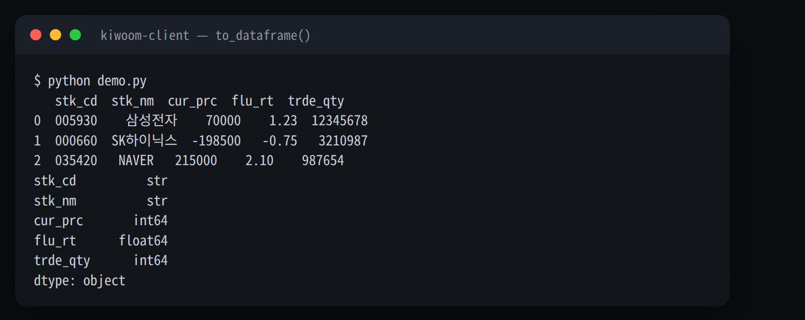

[한국어](README.md) | [English](README_EN.md)

# kiwoom-rest-api — Python wrapper for Kiwoom Securities REST API

[](https://pypi.org/project/kiwoom-client/)
[](https://pypi.org/project/kiwoom-client/)
[](https://github.com/younghwan91/kiwoom-rest-api/actions/workflows/ci.yml)
[](https://github.com/younghwan91/kiwoom-rest-api/blob/main/LICENSE)
[](https://pypi.org/project/kiwoom-client/)
[](https://www.linkedin.com/in/younghwan-chae/)

> **A cross-platform replacement for the legacy Kiwoom OpenAPI+ (OCX/COM).** Automate Korean
> stock (KOSPI/KOSDAQ) trading, quotes and real-time WebSocket data on Windows, macOS and Linux.
> Tokens refresh themselves; sync and async clients both ship.
> **182 REST endpoints · 4 condition-search calls · 19 real-time data types.**

```bash
pip install kiwoom-client
```

> ⚠️ The package is **`kiwoom-client`**, not the repository name. Installing `kiwoom-rest-api`
> from PyPI gets you **someone else's package** registered under that name first.

```python
from kiwoom_rest_api import KiwoomAPI, to_dataframe

api = KiwoomAPI(app_key="YOUR_KEY", app_secret="YOUR_SECRET", is_mock=True)  # no login step

info = api.stock_info.basic_stock_info(stk_cd="005930")            # Samsung Electronics
df   = to_dataframe(api.chart.stock_daily_chart(stk_cd="005930"))  # daily chart → DataFrame

api.order.buy_order(dmst_stex_tp="01", stk_cd="005930",            # buy 10 @ 70,000
                    ord_qty=10, trde_tp="00", ord_uv=70000)
```

Kiwoom returns every field as a string — a price as `"+70000"`, a volume as `"1,234,567"`.
`to_dataframe()` finds the payload key and converts them, while leaving fields whose leading
zero carries meaning (stock codes, dates) as strings.



## How it differs from Kiwoom OpenAPI+ / pykiwoom

| | Kiwoom OpenAPI+ (OCX) | pykiwoom | **kiwoom-client** |
|------|---------------------|----------|---------------------|
| Transport | COM/OCX | OCX wrapper | **REST + WebSocket** |
| OS | Windows only | Windows only | **Windows · macOS · Linux** |
| Python | 32-bit only | 32-bit only | **64-bit** |
| Headless / server | hard (needs GUI) | hard | **yes** |
| Real-time | event callbacks | event callbacks | **async WebSocket** |
| Install | separate module | OCX + module | **one `pip install`** |

On top of that: **automatic token refresh** (reissued before expiry, retried on auth failure),
a **per-TR token-bucket rate limiter** with automatic 429 backoff, **`request_all()` pagination**,
and **`AsyncKiwoomAPI`** exposing the identical interface.

## Real-time WebSocket

```python
import asyncio
from kiwoom_rest_api import KiwoomAPI

ws = KiwoomAPI(app_key="YOUR_KEY", app_secret="YOUR_SECRET").create_websocket()

async def main():
    await ws.connect()                    # includes the LOGIN handshake
    ws.on("0B", lambda d: print(f"Trade {d['item']}: {d['values'].get('10')}"))
    await ws.subscribe(["0B", "0D"], ["005930", "000660"])
    await ws.listen()                     # answers PING, reconnects and re-subscribes

asyncio.run(main())
```

`values` keys are Kiwoom FID numbers (10 = current price, 13 = cumulative volume).
Condition search rides the same socket: `api.condition_search` builds the payload, `ws.send()` sends it.

> **Verification status**: the LOGIN handshake, PING frame and REG acknowledgement are confirmed
> against the live server (api.kiwoom.com). The REAL frame's per-item field names (`item`/`values`)
> have not yet been verified during market hours — please
> [open an issue](https://github.com/younghwan91/kiwoom-rest-api/issues) if you see otherwise.

## Coverage

182 REST endpoints + 4 condition-search calls (WebSocket) + 19 real-time data types.

Account 33 · Stock info 31 · Market data 25 · Rankings 23 · Charts 21 · ELW 11 · ETF 9 ·
Orders 8 · Sectors 6 · Credit orders 4 · Foreign/institutional 4 · SLB 4 · Condition search 4 ·
Themes 2 · Short selling 1

The full reference with method names and API IDs is in
**[docs/api-reference.md](docs/api-reference.md)** (Korean).

## More

- **[Usage guide](docs/guide.md)** — setup, mock↔live, accounts & orders, asyncio, pagination, rate limits (Korean)
- **[FAQ](docs/faq.md)** — app keys, token expiry, handling 429 (Korean)
- **[Examples](examples/)** — basic, market data, trading, async, pandas, WebSocket
- [CHANGELOG](CHANGELOG.md) · [CONTRIBUTING](CONTRIBUTING.md) · [Official Kiwoom guide](https://openapi.kiwoom.com/guide/apiguide)

**Running in production** — the daily collection DAGs in
[quant-airflow](https://github.com/younghwan91/quant-airflow) use this library to load prices,
supply/demand, margin and short-sale data into TimescaleDB every day.

## License

MIT

---

## ⭐ Found this useful?

Please **[⭐ Star it](https://github.com/younghwan91/kiwoom-rest-api)** — it boosts discoverability.
Bugs and questions go to [Issues](https://github.com/younghwan91/kiwoom-rest-api/issues); PRs welcome.

## Related projects — open-source quant stack

Part of an open-source stack spanning Korean equities, US equities and crypto. Each repository stands on its own.

| Market | Project | What it is |
|---|---|---|
| 🇰🇷 Korean equities | **[krx-fundamentals-api](https://github.com/younghwan91/krx-fundamentals-api)** | Korean corporate fundamentals REST API — financial statements, valuation, dividends, screening (DART + KRX + Naver) |
| 🇰🇷 Korean equities | **[krx-news-rest-api](https://github.com/younghwan91/krx-news-rest-api)** | Korean market news & disclosure collection API (FastAPI + Redis) |
| 🇰🇷 Korean equities | **[quant-airflow](https://github.com/younghwan91/quant-airflow)** | Airflow pipeline collecting Korean market data into TimescaleDB — delisted names included, so downstream backtests aren't survivorship-biased |
| 🇰🇷 Korean equities | **[kr-quant](https://github.com/younghwan91/kr-quant)** | KOSPI/KOSDAQ alpha research — walk-forward, random null controls, purged CV and Deflated Sharpe enforced as CI guardrails |
| 🇺🇸 US equities | **[opt_portfolio](https://github.com/younghwan91/opt_portfolio)** | US equity factor engine — walk-forward gated by Deflated Sharpe on point-in-time, survivorship-bias-free data (plus a VAA allocation backtester) |
| 🇺🇸 US equities | **[automated-stock-trading-systems](https://github.com/younghwan91/automated-stock-trading-systems)** | Backtester for Bensdorp's seven non-correlated trading systems (educational reimplementation) |
| ₿ Crypto | **[quantbox-engine](https://github.com/younghwan91/quantbox-engine)** | Crypto futures backtest & execution engine — zero lookahead, backtest↔live parity |

## Author

**Younghwan Chae** · [GitHub @younghwan91](https://github.com/younghwan91) · [LinkedIn](https://www.linkedin.com/in/younghwan-chae/)

See the full open-source quant stack on my [profile](https://github.com/younghwan91).
